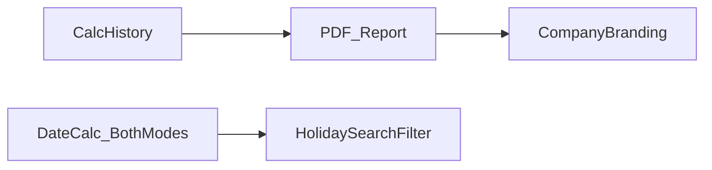

<!-- @format -->

# Suggestions to Improve Ev-Dates

The app already covers the core loop well: holidays → delay calc → copy-ready message. Below are the highest-value upgrades, ordered by impact for sales/ops users.

## Tier 1 — Highest daily value (do next)

1. **Calculation history**
   - Save last N delay calculations in `localStorage` (contract date, duration, results, message).
   - List on the delays tab: reopen, re-copy, delete.
   - Avoids retyping when following up with the same client.

2. **Print / PDF export for delay report**
   - One-click PDF or print of results + ready message (company logo if available).
   - More professional than WhatsApp-only copy for management.

3. **Dual date calculator modes in one modal**
   - Keep “من / إلى → عدد الأيام” (current).
   - Add second mode: “بداية + مدة → تاريخ انتهاء” (working or calendar) — common ops need that was in the old app.

4. **Smarter validation & guidance**
   - Warn if actual dates are before contract date.
   - Show a one-line live preview of elapsed days as dates are typed (before pressing Calculate).
   - Confirm when payment grace choice (21/3) is required before allowing calculate.

5. **Holiday search / filter / month groups**
   - Search by name; filter by نوع (ديني / وطني / دولي).
   - Group calendar list by month for long years.

## Tier 2 — More professional product feel

6. **Branding & report identity**
   - Settings: company name, logo upload, footer line for messages/PDFs.
   - Inject into ready message header and PDF cover.

7. **Onboarding / empty states**
   - First-visit checklist: “تم تعبئة الإجازات ✓ → جرب حاسبة العقود”.
   - Sample “تجربة بحساب مثال” button that fills demo contract dates.

8. **Keyboard & accessibility polish**
   - Focus trap in modals, clearer `aria` on tabs, high-contrast result states, skip-to-content.

9. **Backup / restore**
   - Settings: “تصدير نسخة احتياطية JSON” / “استعادة” for all holidays + preferences (beyond Excel holidays only).

10. **Eid / Hijri confidence UI**
    - Badge “تقريبي” on religious holidays; “تأكيد بعد الرؤية” action that marks them verified (`manual`/`verified` flag).

## Tier 3 — Scale & reliability (when the team grows)

11. **Shared data (beyond one browser)**
    - Today everything is local to one machine. For a real team: Supabase / monday.com / simple API so holidays are shared.
    - Until then: document “مصدر الحقيقة = جهاز الإعدادات + تصدير Excel”.

12. **Configurable grace rules**
    - Settings table for grace brackets (instead of hard-coded) with reset-to-default.
    - Reduces code changes when business rules shift.

13. **Audit trail**
    - Who changed which holiday, when (needs auth + backend).

14. **PWA / offline install**
    - Service worker so sales can use it on mobile without perfect connectivity (still localStorage).

## UX polish (small, high polish)

- Persist last active tab and last selected year.
- Delay tab: sticky “احسب” on mobile after scrolling results.
- Clear “آخر تحديث للإجازات الرسمية” timestamp in Settings.
- Consistent number formatting in all messages (`195 يوم` style everywhere).
- Light unit tests for grace + delay formulas (prevents silent rule regressions).

## What I would ship first (recommended sequence)

1. Calculation history + copy/reopen
2. PDF/print report
3. Date calculator: duration→end date mode
4. Holiday search/filter
5. Company branding in messages

## Out of scope unless you ask

- Full monday.com rewrite, multi-user auth, true astronomical Hijri engine.

---

If you want to proceed, say which tier (or items 1–5) to implement and I will turn that into an execution plan.
