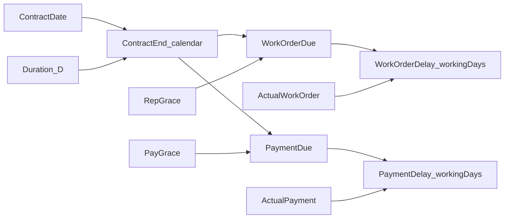

<!-- @format -->

# Contract Delay Calculator + Grace Rules

## Scope

Add a new feature section to the existing static app ([index.html](e:\NEZAMERP\Customers\evesarts\Ev-Dates\index.html) / [script.js](e:\NEZAMERP\Customers\evesarts\Ev-Dates\script.js) / [style.css](e:\NEZAMERP\Customers\evesarts\Ev-Dates\style.css)). Keep the current English install-date and vacations tools unchanged.

## UI (match screenshots, fit existing Bootstrap cards)

Add a new top-level section (after header, before existing calculators) with `dir="rtl"` and Arabic labels:

1. **Banner** — “حساب تأخيرات العقود” + subtitle about work-order / final-payment delays.
2. **بيانات العقد** form:
   - تاريخ العقد (`#contract-date`)
   - مدة العقد بالأيام (`#contract-duration`) — placeholder مثال: 70
   - تاريخ رفع أمر الشغل الفعلي (`#actual-work-order-date`)
   - تاريخ السداد النهائي الفعلي (`#actual-payment-date`)
   - Full-width button: احسب التأخيرات
3. **القواعد والتفاصيل** panel (read-only guide + live fields):
   - أيام سماح المندوب — auto value + short rule list from screenshot
   - سماح السداد — auto/forced value, or choice **21 / 3** when duration is 31–44
   - طريقة الحساب note: grace/deadlines use calendar days (incl. Fridays & holidays)
4. **نتائج التأخير** results card (not in mockups; required to complete the feature): expected deadlines, grace applied, delay days for work order and payment (0 / on-time messaging).

Styling: reuse Bootstrap card layout; add minimal CSS for the orange accent button/banner used in the mockups without redesigning the whole app.

## Business rules (locked defaults)

### Representative grace (`repGrace`) from duration `D`

| Duration      | Grace            |
| ------------- | ---------------- |
| `D ≥ 60`      | 5                |
| `50 ≤ D ≤ 59` | 4                |
| `35 ≤ D ≤ 49` | 3                |
| `31 ≤ D ≤ 34` | 0                |
| `D ≤ 30`      | 0 (special rule) |

(Ranges cover discrete packages shown in the UI: 60+, 55/50, 45/40/35, 31–34, ≤30.)

### Payment grace (`payGrace`)

| Duration      | Behavior                                  |
| ------------- | ----------------------------------------- |
| `D ≥ 45`      | 21 (automatic; choice UI hidden/disabled) |
| `31 ≤ D ≤ 44` | User selects **21** or **3** (default 21) |
| `D ≤ 30`      | 0 forced (special rule; choice UI locked) |

### Date math

- **Contract end / grace offsets:** calendar days (per قواعد طريقة الحساب).  
  `contractEnd = contractDate + (D - 1)` calendar days (inclusive duration, same inclusive convention as the existing install calculator’s start-counts-as-day-1).  
  `workOrderDue = contractEnd + repGrace` calendar days.  
  `paymentDue = contractEnd + payGrace` calendar days.
- **Delay count:** working days after the due date until the actual date, skipping Fridays and dates in the existing `holidays` list (per banner “أيام العمل الفعلية”). If actual ≤ due → delay `0`.
- Duration change live-updates grace fields and shows/hides the 21/3 payment selector before Calculate is pressed.

## Logic in [script.js](e:\NEZAMERP\Customers\evesarts\Ev-Dates\script.js)

Extract small helpers (keep install calc untouched):

- `getRepGrace(duration)`
- `getPaymentGraceMode(duration)` → `{ mode: 'fixed'|'choice', value|options }`
- `addCalendarDays(date, days)`
- `countWorkingDaysBetween(fromExclusive, toInclusive)` — reuse Friday + `holidays` skip rules already in `calculateEndDate`

Wire listeners: duration `input` → update grace UI; calculate button → validate, compute deadlines/delays, render results + toast.

## Files to change

- [index.html](e:\NEZAMERP\Customers\evesarts\Ev-Dates\index.html) — new Arabic RTL sections + result markup
- [script.js](e:\NEZAMERP\Customers\evesarts\Ev-Dates\script.js) — grace + delay calculation
- [style.css](e:\NEZAMERP\Customers\evesarts\Ev-Dates\style.css) — RTL section + orange accent for this feature only

No backend/DB; no persistence required beyond existing holidays `localStorage`.
