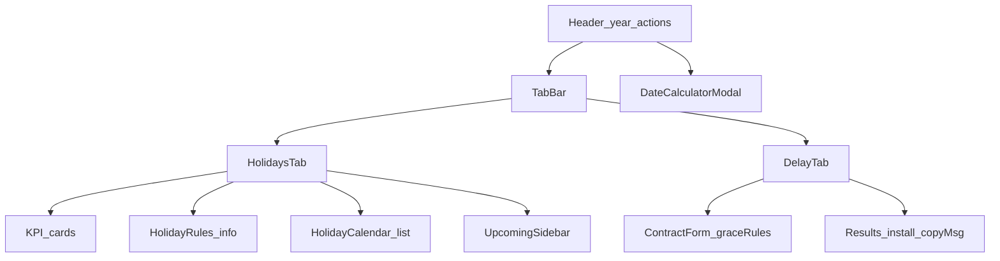

<!-- @format -->

# Full Holiday Management & Contract Delay App

## Decision (default)

Build as a **standalone static web app** in this repo (no monday.com SDK). Persist holidays in `localStorage`. Replace the current mixed English/Arabic Bootstrap page with the Arabic RTL UI from the screenshots.

## Correct delay math (replaces current implementation)

Current code in [`script.js`](e:\NEZAMERP\Customers\evesarts\Ev-Dates\script.js) computes due dates from contract end and counts **working-day** delays. The overview + results screenshot require:

```
elapsed = calendarDays(contractDate → actualDate)   // includes Fridays & holidays
penalty = max(0, elapsed - grace)
```

Display (match screenshot “النتائج”):

- Large number = **elapsed calendar days** (can be negative if before contract? treat as signed difference; green when `elapsed <= grace`)
- Subtext when on-time: `ضمن فترة السماح (X أيام)`
- Subtext when late: `التأخير: Y أيام (بعد خصم X يوم السماح)` where `Y = elapsed - grace`

Grace rules stay as already coded (`getRepGrace` / payment 21|3|0).

### Suggested installation date

- `laterDate = max(workOrderDate, paymentDate)`
- `D >= 45` → `laterDate + (D - 21)` calendar days; label explains “عقد ≥ 45”
- `35 <= D <= 44` → `laterDate + D` calendar days; label like screenshot
- `D < 35` → hide suggestion

### Ready message + copy

Generate Arabic report text (date range, elapsed, penalty after grace, duration, closing note) and a **نسخ** button using `navigator.clipboard`.

Arabic day grammar helper: 1 → يوم واحد, 2 → يومين, 3–10 → X أيام, 11+ → X يوم.

## UI architecture



### Shell ([`index.html`](e:\NEZAMERP\Customers\evesarts\Ev-Dates\index.html) + [`style.css`](e:\NEZAMERP\Customers\evesarts\Ev-Dates\style.css))

- Full page `dir="rtl" lang="ar"`
- Header: title نظام حساب الإجازات والمواعيد, year select 2020–2035, actions: ملء كل السنوات, تصدير سنة / الكل, استيراد, حاسبة التواريخ, إضافة إجازة, تحديث التفاصيل, حذف التكرار
- Tab switcher: الإجازات الرسمية | حساب تأخيرات العقود
- Restyle with screenshot palette (olive/dark panels, white cards, orange accents) — replace/override current green Bootstrap theme for this app

### Tab 1 — Holidays

Upgrade holiday model from `{ reason, date }` to:

```js
{ id, name, startDate, endDate, type: 'religious'|'national'|'international', notes }
```

Migrate existing `localStorage` “holidays” entries on load (`reason→name`, `date→start/end`, type default `national`).

Features:

- KPI cards for selected year: total, religious, national, Fridays count, working days (365/366 − Fridays − unique holiday dates)
- Rules info box (Founding Day / National Day / Eid notes + green/red callouts)
- Calendar list cards with type pills, edit/delete
- Upcoming sidebar with days-until badges
- Seed/auto-fill official dates for 2020–2035 (national fixed dates + approximate Hijri Eid ranges as data tables; “تحديث التفاصيل الرسمية” re-seeds non-manual items; mark `manual: true` on user edits so auto-update skips them)
- Dedupe by name+start+end; Excel import/export columns: Name, Start Date, End Date, Type, Notes

### Tab 2 — Contract delays

Keep/adapt the form + rules panel already added; replace results with screenshot layout:

1. Two result cards (WO / Payment)
2. Suggested installation card
3. Ready message + copy

Short-contract warning (`D ≤ 30`): red banner “عقد قصير — لا أيام سماح”.

### Date calculator modal

Modal from screenshot:

- Modes: أيام عمل (skip Friday + holiday dates) | حساب عادي (calendar)
- Inputs: start + duration → end date + list of excluded days when in working mode
- Reuse existing skip logic from `calculateEndDate`

## Logic modules in [`script.js`](e:\NEZAMERP\Customers\evesarts\Ev-Dates\script.js)

Organize (still one file, clear sections):

1. Holiday store + migrate + seed 2020–2035
2. KPI / upcoming / CRUD / import-export / dedupe
3. Grace + delay calc (calendar elapsed − grace)
4. Installation suggestion
5. Ready message + Arabic pluralization + clipboard
6. Date calculator modal
7. Tab / year UI wiring

Remove dependence on English-only install sections (or fold them into the modal). Keep PDF export only if still useful for excluded days from the modal; otherwise drop from primary UI.

## Files

- Rewrite structure of [`index.html`](e:\NEZAMERP\Customers\evesarts\Ev-Dates\index.html)
- Major update [`script.js`](e:\NEZAMERP\Customers\evesarts\Ev-Dates\script.js)
- Major update [`style.css`](e:\NEZAMERP\Customers\evesarts\Ev-Dates\style.css)

Out of scope: monday.com board sync, auth, audit logs, true Hijri astronomy (use precomputed approximate Eid tables + editable dates).
